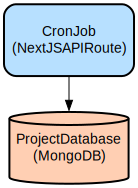

# Next.js Portfolio with Dynamic Project Management and Chatbot Integration

A modern, feature-rich portfolio website built with Next.js 13+, offering dynamic project management, real-time status updates, and an AI-powered chatbot for visitor interaction. The application combines sleek UI components with robust backend functionality to create an engaging developer portfolio experience.

This portfolio application leverages Next.js App Router and Server Components to deliver optimal performance and SEO benefits. It features a comprehensive admin dashboard for content management, automated project status updates via cron jobs, and interactive UI elements built with Framer Motion animations. The application integrates with MongoDB for data persistence and includes a chatbot powered by Google's Generative AI, providing visitors with an interactive way to learn more about the portfolio owner.

## Repository Structure
```
.
├── app/                      # Next.js application routes and API endpoints
│   ├── api/                 # API routes for authentication, projects, chatbot, etc.
│   ├── dashboard/          # Admin dashboard pages and layouts
│   └── work/              # Project showcase pages
├── components/             # Reusable React components
│   ├── sections/          # Major section components (projects, skills, etc.)
│   ├── ui/               # Base UI components (buttons, cards, etc.)
│   └── dashboard/        # Dashboard-specific components
├── lib/                   # Core utilities and configurations
│   ├── db.ts             # Database connection setup
│   └── interface.ts      # TypeScript interfaces
├── models/               # MongoDB schema definitions
├── store/               # Redux store configuration
└── utils/              # Utility functions and helpers
```

## Usage Instructions
### Prerequisites
- Node.js 16.x or higher
- MongoDB database
- Google Generative AI API key
- Environment variables configured (see below)

### Installation
1. Clone the repository:
```bash
git clone <repository-url>
cd portfolio
```

2. Install dependencies:
```bash
npm install
```

3. Create a `.env` file with the following variables:
```env
NEXT_PUBLIC_MONGO_URL=your_mongodb_url
NEXT_PUBLIC_API_URL=your_api_url
GOOGLE_AI_API_KEY=your_google_ai_key
CRON_SECRET=your_cron_secret
```

### Quick Start
1. Start the development server:
```bash
npm run dev
```

2. Access the application:
- Frontend: http://localhost:3000
- Dashboard: http://localhost:3000/dashboard (requires authentication)

### More Detailed Examples

#### Managing Projects
```typescript
// Add a new project
const project = {
  title: "Project Name",
  description: "Project description",
  technologies: ["Next.js", "TypeScript"],
  status: "in-progress",
  startdate: "2024-01-01",
  enddate: "2024-12-31"
};

await fetch('/api/projects', {
  method: 'POST',
  body: JSON.stringify(project)
});
```

#### Using the Chatbot
```typescript
// Initialize chatbot conversation
const response = await fetch('/api/chatbot', {
  method: 'POST',
  body: JSON.stringify({ message: "Tell me about your experience" })
});
```

### Troubleshooting

#### Common Issues

1. MongoDB Connection Errors
```bash
# Check MongoDB connection
node -e "require('./lib/db.js').connectDB()"
```
Solution: Verify MongoDB URL in environment variables and network connectivity.

2. Project Status Updates Not Working
```bash
# Manually trigger status update
curl -X POST http://localhost:3000/api/projects/update-status \
  -H "Authorization: Bearer ${CRON_SECRET}"
```
Solution: Check cron job configuration and authorization headers.

#### Debug Mode
Enable debug logging by setting:
```env
DEBUG=true
```

Log files location: `./logs/debug.log`

## Data Flow
The application follows a structured data flow for managing portfolio content and user interactions.

```ascii
[Client] → [Next.js API Routes] → [MongoDB]
    ↑              ↓               ↓
[Redux Store] ← [Server Actions] ← [Models]
    ↓              ↑               ↑
[UI Components] → [Cache] → [Data Validation]
```

Key component interactions:
1. Client requests are handled by Next.js API routes
2. API routes interact with MongoDB through Mongoose models
3. Server actions provide type-safe database operations
4. Redux store manages client-side state (chat history)
5. UI components consume data through hooks and server actions
6. Caching layer optimizes repeated data fetches
7. Data validation occurs at model and API levels

## Infrastructure



### Lambda Functions
- `/api/cron`: Daily project status update (runs at 10:00 AM)
  - Updates project statuses based on start/end dates
  - Requires CRON_SECRET for authentication
  - Handles status transitions: upcoming → in-progress → completed

### Database
- MongoDB collections:
  - Projects: Stores project information and status
  - Users: Manages authentication and user roles
  - Testimonials: Stores client testimonials
  - Socials: Manages social media links

## Deployment
1. Prerequisites:
   - Vercel account
   - MongoDB Atlas cluster
   - Environment variables configured

2. Deploy to Vercel:
```bash
vercel --prod
```

3. Configure cron job:
```json
{
  "crons": [{
    "path": "/api/cron",
    "schedule": "0 10 * * *"
  }]
}
```